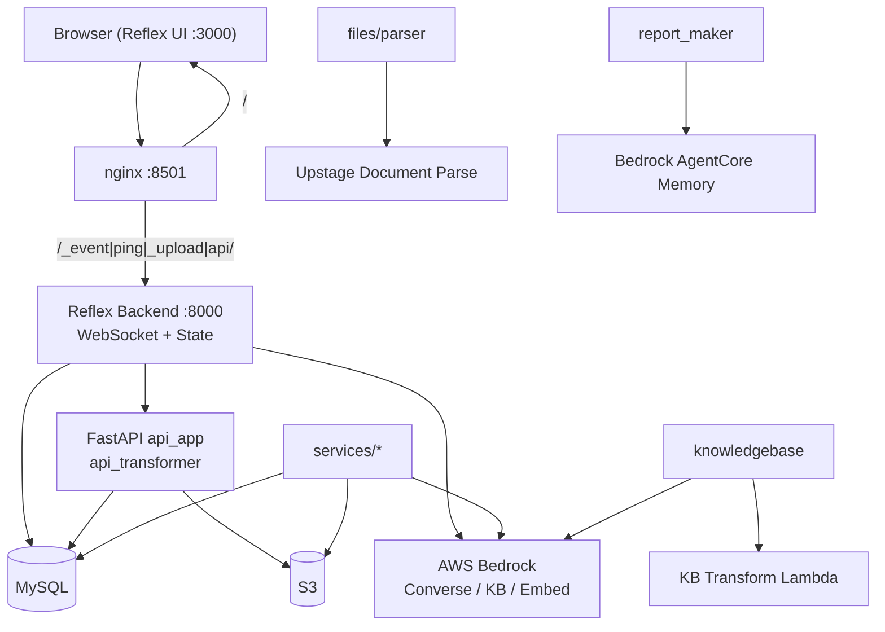
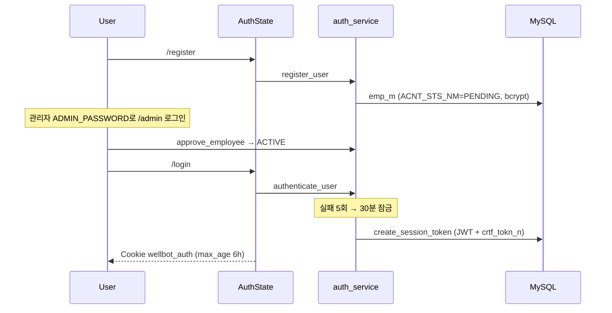
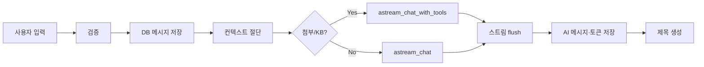

# Wellbot 인수인계 문서

> **버전:** 0.2.0  
> **작성 기준:** 2026-07-27  
> **대상:** 인수자 / 운영·개발 담당자  
> **관련:** [README.md](../README.md), [docs/ddl.sql](ddl.sql), [docs/nginx-reflex.conf](nginx-reflex.conf)

---

## 목차

1. [서비스 개요](#1-서비스-개요)
2. [기술 스택](#2-기술-스택)
3. [디렉터리 구조](#3-디렉터리-구조)
4. [아키텍처](#4-아키텍처)
5. [핵심 플로우](#5-핵심-플로우)
6. [주요 소스 맵](#6-주요-소스-맵)
7. [API · 페이지 라우트](#7-api--페이지-라우트)
8. [데이터베이스](#8-데이터베이스)
9. [설정 · 환경변수](#9-설정--환경변수)
10. [로컬 실행 · 배포](#10-로컬-실행--배포)
11. [운영 스크립트 · 테스트](#11-운영-스크립트--테스트)
12. [코딩 컨벤션](#12-코딩-컨벤션)
13. [운영 안전 (백업·시크릿·비용)](#13-운영-안전-백업시크릿비용)
14. [알려진 이슈 · 기술부채](#14-알려진-이슈--기술부채)
15. [인수인계 체크리스트](#15-인수인계-체크리스트)
16. [트러블슈팅](#16-트러블슈팅)

---

## 1. 서비스 개요

**Wellbot**은 AWS Bedrock 기반 **모듈형 사내 AI 플랫폼**이다.  
Reflex UI와 FastAPI를 한 프로세스에 결합해, 아래 기능을 단일 앱으로 제공한다.

| 영역 | 기능 |
|------|------|
| **채팅** | Bedrock Converse 스트리밍, thinking, 비전·문서 첨부, 프롬프트 프리셋, 대화 제목 자동 생성 |
| **Knowledge Base (RAG)** | 개인 / 팀 / 공용 KB (Bedrock KB + S3 + Custom Transformation Lambda) |
| **AI 업무 서비스** | 보고서 draft 지원(`report_maker`), PDF 오류 탐지(`report_checker`) |
| **관리** | 사원·부서·에이전트 CRUD, 토큰/로그 모니터링 |

**목적:** 단순 챗봇에서 RAG·에이전트 역량으로 확장하는 사내 PoC / 업무용 플랫폼.

**사용자 여정 (요약)**

1. `/register` 회원가입 → 계정 `PENDING`
2. 관리자가 `/admin`에서 승인 → `ACTIVE`
3. `/login` 후 `/` 채팅 또는 `/ai-services` 업무 서비스 이용
4. 개인·팀 KB 업로드 후 채팅에서 KB 검색 활용

---

## 2. 기술 스택

| 계층 | 기술 |
|------|------|
| 언어 / 패키지 | Python ≥ 3.11, `uv`, Reflex `0.8.28.post1` |
| UI | Reflex (React/WebSocket 생성). `.web/`는 빌드 산출물 |
| HTTP API | FastAPI (`api_transformer`로 Reflex에 마운트) |
| DB | MySQL + SQLAlchemy 2 + PyMySQL |
| AI | AWS Bedrock Converse / ConverseStream, Titan Embed, (선택) Bedrock AgentCore |
| 스토리지 | S3 (첨부·KB·report 산출물) |
| 문서 파싱 | pdfplumber, python-docx/pptx, openpyxl, (선택) Upstage Document Parse |
| 로컬 RAG | FAISS + numpy (대화 첨부 검색) |
| 인증 | bcrypt + JWT (`wellbot_auth` 쿠키) + DB 토큰 테이블 |

---

## 3. 디렉터리 구조

```
wellbot/                          # 프로젝트 루트
├── README.md                     # 설치·아키텍처·라우트 요약
├── pyproject.toml / uv.lock      # 의존성 (uv)
├── .python-version               # 3.11
├── .env.example                  # 환경변수 템플릿 (.env는 gitignore)
├── rxconfig.py                   # Reflex Config (app_name=wellbot)
├── config/                       # YAML·MD 런타임 설정
│   ├── models.yaml               # Bedrock 모델·title·embedding
│   ├── prompts.yaml + prompts/   # 시스템 프롬프트 프리셋
│   ├── knowBase.yaml             # KB 동작 옵션·공용 folders
│   ├── ai_services.yaml          # /ai-services 카드 카탈로그
│   ├── greetings.yaml            # 채팅 환영 문구
│   └── notice.md                 # 로그인 공지
├── docs/
│   ├── ddl.sql                   # MySQL 스키마 (SoT)
│   ├── nginx-reflex.conf         # 운영 프록시 샘플 (listen 8501)
│   ├── handover.md               # 본 문서
│   └── */                        # KB·리팩터 설계/감사 문서
├── scripts/                      # CLI 운영 유틸 (상주 cron 아님)
│   ├── shared_kb_manager.py      # 공용 KB 업로드/ingest
│   ├── cleanup_personal_kb.py
│   ├── transform_lambda.py       # Lambda용 HTML 변환 (패키징)
│   ├── migrate_report_maker_agnt_id.py
│   ├── reset_report_maker.py
│   └── verify_attachment_index.py
├── tests/
│   ├── chat/
│   └── report_maker/
└── wellbot/                      # 메인 Python 패키지
    ├── wellbot.py                # 앱 엔트리 · 페이지 등록
    ├── env.py / paths.py / constants.py / styles.py
    ├── api/                      # FastAPI 라우터
    ├── pages/                    # Reflex 페이지
    ├── components/               # UI (chat/sidebar/admin)
    ├── state/                    # Reflex State (+ chat_helpers)
    ├── services/                 # 비즈니스 로직
    │   ├── ai/bedrock/
    │   ├── auth/ · chat/ · files/
    │   ├── knowledgebase/
    │   ├── report_maker/ · report_checker/
    │   ├── admin/ · core/
    ├── models/                   # SQLAlchemy ORM
    └── logger/                   # 구조화 로깅·타이밍
```

**생성/로컬 산출물 (커밋 대상 아님):** `.web/`, `.venv/`, `.states/`, `logs/`  
**Docker/K8s 매니페스트:** 없음 → EC2 등에서 프로세스 + nginx로 운영.

---

## 4. 아키텍처

### 4.1 컴포넌트 다이어그램



### 4.2 레이어 역할

| 계층 | 경로 | 역할 |
|------|------|------|
| UI | `pages/`, `components/` | 화면 트리 |
| State | `state/` | 세션 상태, 이벤트, 스트리밍 UI 갱신 |
| Services | `services/` | DB·AWS·파싱·비즈니스 규칙 (Reflex 비의존 지향) |
| API | `api/` | multipart 대용량 업로드/다운로드 (Reflex `rx.upload` 한도 우회) |
| Config | `config/`, `.env`, `constants.py` | 모델·프롬프트·KB 옵션 vs 시크릿/인프라 vs 하드 한도 |
| Models | `models/` | ORM ↔ MySQL |

### 4.3 진입점 순서

`wellbot/wellbot.py`:

1. `init_env()` — `.env` lazy 로드
2. `setup_logging()` — 다른 모듈 import 전 로깅 구성
3. `rx.App(api_transformer=api_app)` — FastAPI 마운트
4. `app.add_page(...)` — 라우트·`on_load` 등록

### 4.4 외부 의존성

| 서비스 | 용도 |
|--------|------|
| Bedrock Runtime | 채팅 Converse/Stream, 제목 생성 |
| Bedrock Knowledge Bases | 개인/팀/공용 RAG retrieve·ingest |
| S3 | 첨부 원본·파생물, KB staging, report 산출물 |
| Custom Transformation Lambda + S3 Vectors | 개인/팀 KB 문서 변환·벡터 |
| Upstage Document Parse (선택) | PDF/문서 고품질 파싱 (`FILE_PARSER_MODE=upstage`) |
| Bedrock AgentCore Memory (선택) | report_maker 문체 메모리 (`REPORT_MAKER_MEMORY_ID`) |

**스케줄/웹훅:** 상주 cron·webhook 없음.  
백그라운드는 FastAPI `BackgroundTasks`(첨부 파싱)와 State 내 비동기/스레드 작업만 존재. 공용 KB 운영은 `scripts/shared_kb_manager.py` CLI.

---

## 5. 핵심 플로우

### 5.1 인증 · 회원가입 · 관리자



| 단계 | 상세 |
|------|------|
| 회원가입 | `AuthState` → `auth_service.register_user` → `PENDING` |
| 승인 | `/admin` → `approve_employee` → `ACTIVE` |
| 로그인 | `authenticate_user` → JWT + `crtf_tokn_n` → 쿠키 `wellbot_auth` |
| 가드 | 페이지: `AuthState.check_auth` / API: Cookie → `validate_session_token` |
| 로그아웃 | `invalidate_session_token` (`DISS_YN=Y`) |
| 이스터에그 | 로그인 아이콘 5회 클릭 → `/admin` |

**보안 포인트**

- `emp_no` / `dept_cd`는 클라이언트 Form을 신뢰하지 않고 **세션 쿠키에서 도출**
- 첨부·다운로드는 소유권/`can_attach`로 IDOR 방어
- 세션 만료: `TOKEN_EXPIRE_HOURS = 6` (`constants.py`)

### 5.2 메인 채팅 (`/` · `ChatState.send_message`)

핵심 경로: `wellbot/state/chat_state.py`

1. 입력 검증 · 첨부 processing 중이면 toast로 차단
2. 사용자 메시지 State 반영 · 임시 제목 · pending 첨부 → conversation
3. DB: 신규면 `save_conversation` + system 메시지 · `append_message`(user)
4. 컨텍스트 윈도우 절단 (`LLM_CONTEXT_MAX_TOKENS`, 기본 12k)
5. system prompt 보강: datetime / attachments / KB 지침 (`chat_helpers/system_prompt.py`)
6. 검색 가능 첨부 또는 KB on → `tool_executor.build_tool_config` → `astream_chat_with_tools`  
   아니면 `astream_chat`
7. 스트림 이벤트(`text` / `thinking` / `tool_use` / `tool_result` / `usage`)를 `STREAM_FLUSH_INTERVAL_SEC`로 배치 푸시
8. **Tools**
   - `search_attachment` — FAISS 의미검색
   - `read_attachment` — 문서 전체/구간 읽기
   - `kb_search` — Bedrock KB retrieve (scope는 UI `kb_modes`를 서버가 주입)
9. 완료 후 AI 메시지 저장 · 토큰/응답시간 기록 · 첫 turn이면 `generate_title`



### 5.3 채팅 첨부 업로드

1. 브라우저 JS (`chat_helpers/upload_script.py` → `build_upload_script`) → `POST /api/upload`
2. JWT · 대화 소유권(`can_attach`) · 용량/개수 검증
3. `register_attachment` → S3 original + `atch_file_m` (+ 메시지 매핑)
4. `BackgroundTasks` → `process_attachment`: 파싱 → 청킹 → Titan 임베딩 → S3 chunks/index (FAISS)
5. **상태 필드 `token_count`**
   - `None` = 처리중
   - `≥ 0` = 완료
   - `-1` = 실패

**한도** (`constants.py`): 단일 50MB, 메시지당 5개, 대화당 20개 / 200MB

### 5.4 Knowledge Base

#### 개인 / 팀 (앱 UI)

1. `POST /api/upload_kb_files` → staging만 S3 (`users{env}/…` 또는 `teams{env}/…`)  
   - `emp_no` / `dept`는 쿠키에서 도출
2. `ChatState`가 변환·분할·색인·ingest 트리거  
   - Upstage/local, pptx→json, xlsx 분할 등
3. Bedrock KB 생성/조회: `personal_kb_manager` / `team_kb_manager`  
   - `APP_ENV=dev`이면 `-dev` 네임스페이스
4. 채팅 시 `kb_search` → `kb_retriever.retrieve`

#### 공용

- `KB_ID` + `scripts/shared_kb_manager.py` (upload / ingest / list / add-folder …)
- 폴더 매핑: `config/knowBase.yaml` → `shared_kb.folders`

#### 문서 수 상한

| scope | 상한 |
|-------|------|
| personal | 5 |
| team | 10 |
| shared | 관리자 CLI라 상한 없음 |

### 5.5 보고서 draft (`report_maker`)

경로: `/ai-services/report-generator`

1. 템플릿(유형) CRUD → `agnt_mmry_use_n` (`agent_id=RPT_DRFT_GEN`)
2. 스타일 문서 업로드 → `POST /api/report_maker/upload` (`kind=style`) → S3 → 문체 분석 → AgentCore Memory 또는 S3 `combined_style` 폴백
3. 대화형 플로우: 주제 → 페이지 수/구조 게이트 → outline 생성·수정 → (선택) HTML 슬라이드
4. 채팅에서 핸드오프: `ChatState._report_seed_content` → `ReportMakerState.on_load`가 소비
5. 사용량: 메시지에 `agnt_id` 태깅 → 사이드바 일반 채팅 목록에서 제외

설정: `wellbot/services/report_maker/report_maker.yaml`

### 5.6 보고서 오류 탐지 (`report_checker`)

경로: `/ai-services/report-checker`

1. `POST /api/report_checker/upload` → S3 job prefix, `job_id` 반환
2. `ReportCheckerState.analyze` → PDF 텍스트 추출 → `pipeline.run_analysis`
   - 오탈자 → (선택) 주의항목 → 표기 일관성 → 사실 추출·충돌 검증
3. HTML 리포트 S3 저장 → `POST /api/report_checker/download` 스트리밍

설정: `wellbot/services/report_checker/report_checker.yaml`

### 5.7 관리 · 모니터링

- `/admin`: 부서·사원·에이전트 CRUD, 승인/잠금해제
- 모니터링: 로그 파일 JSON 이벤트를 `monitoring_service.build_dashboard`로 집계 (모델·인증·ingest·AI 서비스)

---

## 6. 주요 소스 맵

### 6.1 엔트리 · 인프라

| 파일 | 역할 |
|------|------|
| `wellbot/wellbot.py` | Reflex 앱·라우트 등록 |
| `wellbot/env.py` | `init_env()` |
| `wellbot/paths.py` | `PROJECT_ROOT`, YAML 경로, temp dir |
| `wellbot/constants.py` | 토큰/업로드/KB/스트림/풀 크기 등 운영 상수 |
| `wellbot/api/app.py` | FastAPI lifespan · 로그 미들웨어 · 라우터 include |
| `wellbot/services/core/database.py` | `get_session()` lazy engine |
| `wellbot/services/core/settings.py` | `get_config()`, `get_ai_services()` |
| `wellbot/services/core/executor.py` | I/O 스레드풀 |
| `wellbot/services/core/cpu_pool.py` | CPU 프로세스풀 (파싱) |

### 6.2 인증 · 채팅

| 파일 | 중요 심볼 |
|------|-----------|
| `state/auth_state.py` | `AuthState` — 로그인/세션 쿠키 |
| `services/auth/auth_service.py` | `authenticate_user`, `create/validate/invalidate_session_token`, `register_user` |
| `state/chat_state.py` | `ChatState.send_message`, KB UI, 업로드 트리거 |
| `services/chat/chat_service.py` | 대화/메시지 CRUD, `can_attach` |
| `services/chat/tool_executor.py` | tool 스펙 · `execute_tool` |
| `services/ai/bedrock/converse.py` | `astream_chat` |
| `services/ai/bedrock/tool_loop.py` | `astream_chat_with_tools` |
| `services/ai/bedrock/title.py` | `generate_title` |
| `services/files/attachment_service.py` | `register_attachment`, `process_attachment` |

### 6.3 KB · Report · Admin

| 파일 | 역할 |
|------|------|
| `services/knowledgebase/personal_kb_manager.py` | 개인 KB 생성·관리 |
| `services/knowledgebase/team_kb_manager.py` | 팀 KB |
| `services/knowledgebase/kb_ingest_service.py` | ingest |
| `services/knowledgebase/kb_retriever.py` | retrieve |
| `state/report_maker_state.py` | outline 플로우 상태머신 |
| `services/report_maker/*` | style / analysis / build / slides / memory |
| `state/report_checker_state.py` | 분석 UI |
| `services/report_checker/pipeline.py` | `run_analysis` |
| `state/admin_state.py` | 관리자 CRUD |
| `services/admin/admin_service.py` | 부서·사원·에이전트 |
| `services/admin/monitoring_service.py` | 대시보드 집계 |

### 6.4 API

| 파일 | 엔드포인트 |
|------|------------|
| `api/upload.py` | `POST /api/upload` |
| `api/download.py` | `POST /api/download/{file_no}` |
| `api/kb_upload.py` | `POST /api/upload_kb_files` |
| `api/kb_download.py` | `POST /api/download_kb` |
| `api/client_log.py` | `POST /api/client_log` |
| `api/report_maker_api.py` | `POST /api/report_maker/upload` |
| `api/report_checker_api.py` | `POST /api/report_checker/upload`, `/download` |

---

## 7. API · 페이지 라우트

### 7.1 FastAPI (Cookie `wellbot_auth` JWT)

OpenAPI docs 비활성 (`docs_url=None`).

| Method | Path | 목적 |
|--------|------|------|
| `POST` | `/api/upload` | 채팅 첨부 → 즉시 응답 + 백그라운드 파싱/임베딩 |
| `POST` | `/api/download/{file_no}` | 첨부 S3 프록시 다운로드 (소유권 검증) |
| `POST` | `/api/upload_kb_files` | KB staging (`upload_target`: personal\|team) |
| `POST` | `/api/download_kb` | KB 파일 다운로드 |
| `POST` | `/api/client_log` | 브라우저 오류 비콘 (인증 선택) |
| `POST` | `/api/report_maker/upload` | style/topic 파일 → S3 |
| `POST` | `/api/report_checker/upload` | PDF → `job_id` |
| `POST` | `/api/report_checker/download` | 결과 HTML 스트리밍 |

### 7.2 Reflex 페이지

| Path | 페이지 | on_load |
|------|--------|---------|
| `/` | 채팅 | `AuthState.check_auth`, `ChatState.on_load` |
| `/login` | 로그인 | `AuthState.check_login_page` |
| `/register` | 회원가입 | `AuthState.load_dept_list` |
| `/admin` | 관리 | `AdminState.on_admin_load` |
| `/ai-services` | 카탈로그 | `AuthState.check_auth` |
| `/ai-services/report-generator` | report_maker | auth + `ReportMakerState.on_load` |
| `/ai-services/report-generator/style` | 스타일 편집 | auth + `load_style_editor` |
| `/ai-services/report-checker` | report_checker | `AuthState.check_auth` |

nginx는 `/_event`, `/ping`, `/_upload`, `/api/`를 `:8000`으로 프록시 (`docs/nginx-reflex.conf`).

---

## 8. 데이터베이스

스키마 소스 오브 트루스: [`docs/ddl.sql`](ddl.sql)  
ORM: `wellbot/models/` (컬럼은 DB SI 약어 매핑, 클래스명은 도메인 영문. 예: `Employee` / `EmpM` 병행, 신규 코드는 도메인명 권장)

| 테이블 | 모델 | 용도 |
|--------|------|------|
| `dept_m` | `Dept` | 부서, 일/월 토큰 한도, 허용 모델 JSON |
| `emp_m` | `Employee` | 사원, 비밀번호, 역할, 상태(`PENDING`/`ACTIVE`), 잠금 |
| `crtf_tokn_n` | `AuthToken` | JWT 세션 (폐기·만료) |
| `agnt_m` | `Agent` | 에이전트 마스터 |
| `agnt_mmry_use_n` | `AgentMemory` | report_maker 템플릿 등 사용자별 메모리 메타 |
| `chtb_smry_d` | `ChatSummary` | 대화 세션(제목·모델·즐겨찾기) |
| `chtb_msg_d` | `ChatMessage` | 메시지, 토큰, `agnt_id`, 응답시간 |
| `chtb_msg_atch_file_d` | `ChatMessageAttachment` | 메시지↔첨부 N:M |
| `atch_file_m` | `Attachment` | 첨부 메타·S3 URL·토큰수 |

**문서 DB 없음.**  
- KB 벡터: Bedrock / S3 Vectors  
- 채팅 첨부 인덱스: S3의 FAISS 파생물

### ER 관계 (개념)

```
dept_m 1──* emp_m
emp_m 1──* crtf_tokn_n
emp_m 1──* chtb_smry_d
chtb_smry_d 1──* chtb_msg_d
chtb_msg_d *──* atch_file_m  (via chtb_msg_atch_file_d)
agnt_m 1──* agnt_mmry_use_n *── emp_m
```

---

## 9. 설정 · 환경변수

### 9.1 관심사 분리

| 관심사 | 위치 |
|--------|------|
| 시크릿·인프라 | `.env` ← `.env.example` |
| LLM 모델 목록 | `config/models.yaml` |
| 채팅 프롬프트 | `config/prompts.yaml`, `config/prompts/` |
| KB 동작 옵션 | `config/knowBase.yaml` + `KB_*` env |
| AI 서비스 카드 | `config/ai_services.yaml` |
| report_maker | `wellbot/services/report_maker/report_maker.yaml` |
| report_checker | `wellbot/services/report_checker/report_checker.yaml` |
| 운영 상수 (업로드 한도 등) | `wellbot/constants.py` |

### 9.2 필수 · 주요 환경변수

| 변수 | 용도 |
|------|------|
| `DB_URL` | `mysql+pymysql://...` |
| `AWS_REGION` / `S3_REGION` | Bedrock·S3 리전 |
| `APP_ENV` | `dev` → KB/S3 `-dev` 네임스페이스 / `prd` → 접미사 없음 |
| `JWT_SECRET` | 세션 JWT 서명 (운영에서 반드시 변경) |
| `ADMIN_PASSWORD` | `/admin` |
| `S3_BUCKET_NAME` / `S3_KEY_PREFIX` | 첨부·KB·report 공통 버킷 |
| `KB_S3_INTERMEDIATE_BUCKET` | Lambda 중간 결과 |
| `KB_S3_VECTOR_BUCKET` | S3 Vectors (개인/팀) |
| `KB_LAMBDA_ARN` / `KB_ROLE_ARN` | KB 인프라 |
| `KB_ID` | 공용 Bedrock KB ID |
| `UPSTAGE_API_KEY` / `UPSTAGE_API_URL` | Document Parse |
| `REPORT_MAKER_MEMORY_ID` | AgentCore (없으면 S3 폴백) |
| `LOG_ENV` / `LOG_LEVEL` | 로깅 프리셋/레벨 |

코드/env로 조절 가능한 튜닝값 예: `IO_EXECUTOR_MAX_WORKERS`, `STREAM_MAX_CONCURRENT`, `STREAM_FLUSH_INTERVAL_SEC`, `LLM_CONTEXT_MAX_TOKENS`, `MESSAGE_PAGE_SIZE`, `DB_POOL_SIZE` / `DB_MAX_OVERFLOW` / `DB_POOL_RECYCLE_SEC` / `DB_POOL_TIMEOUT_SEC`, `CPU_POOL_MAX_WORKERS`, `TOOL_RESULT_MAX_TOKENS`, `READ_ATTACHMENT_MAX_TOKENS` 등.

> ⚠️ 이 튜닝 변수들은 `constants.py`에서 `os.environ.get(...)` 기본값으로 읽지만 **`.env.example`에는 문서화되어 있지 않다.** 운영에서 값을 바꾸려면 `.env`에 직접 키를 추가하고 기본값은 `constants.py`에서 확인한다. (예: `DB_POOL_SIZE=40`) 파서 모드(`FILE_PARSER_MODE`, `PDF_VIA_UPSTAGE`)는 env가 아니라 `constants.py`에서만 변경 가능하다.

### 9.3 파서 모드

`constants.FILE_PARSER_MODE`:

| 값 | 동작 |
|----|------|
| `local` | 로컬 라이브러리만 |
| `upstage` | Upstage Document Parse (현재 기본값) |
| `hybrid` | local 실패 시 upstage 폴백 (`FILE_PARSER_FALLBACK`) |

PDF는 `PDF_VIA_UPSTAGE`로 별도 제어 (현재 `True`).

---

## 10. 로컬 실행 · 배포

### 10.1 Prerequisites

- Python 3.11+ (`.python-version`), [`uv`](https://github.com/astral-sh/uv)
- MySQL (`docs/ddl.sql` 적용)
- AWS 자격증명 — Bedrock, S3, (KB 사용 시) Lambda / IAM Role / S3 Vectors
- (선택) Upstage API — `FILE_PARSER_MODE`가 `upstage` / `hybrid`일 때
- (선택) `REPORT_MAKER_MEMORY_ID` — AgentCore 스타일 메모리

### 10.2 로컬 개발

```bash
# 1) 의존성
uv sync

# 2) 환경변수
cp .env.example .env
# DB_URL, AWS_REGION, S3_BUCKET_NAME, JWT_SECRET 등 필수값 입력

# 3) DB 스키마
# MySQL에 docs/ddl.sql 실행

# 4) 개발 서버
reflex run
```

- 프론트 ≈ `:3000`, 백엔드 ≈ `:8000`
- 회원가입(`/register`) 후 관리자 승인, 또는 `ADMIN_PASSWORD`로 `/admin` 접근

### 10.3 운영 배포

1. EC2 등에서 `uv sync` + `.env` 설정 + MySQL DDL
2. Reflex 프로세스 기동 (`reflex run` 또는 동등)
3. nginx에 [`docs/nginx-reflex.conf`](nginx-reflex.conf) 반영
   - `listen 8501`
   - UI → `:3000`, WS/API → `:8000`
   - `client_max_body_size 60m`
   - `proxy_read_timeout 600s` (긴 LLM 스트림 — **필수**)
4. `APP_ENV=prd`(또는 접미사 없는 설정)로 운영 네임스페이스 사용
5. AWS: Bedrock 모델 액세스, S3, KB Role/Lambda/Vectors, (선택) AgentCore

---

## 11. 운영 스크립트 · 테스트

### 11.1 scripts/

| 스크립트 | 용도 |
|----------|------|
| `shared_kb_manager.py` | 공용 KB 업로드·ingest·폴더 추가 |
| `cleanup_personal_kb.py` | 개인 KB 정리 |
| `transform_lambda.py` | KB Custom Transformation Lambda용 HTML 변환 (패키징 소스) |
| `migrate_report_maker_agnt_id.py` | report_maker agent_id 마이그레이션 |
| `reset_report_maker.py` | report_maker 데이터 리셋 |
| `verify_attachment_index.py` | 첨부 FAISS 인덱스 검증 |

사용법은 각 스크립트 docstring 참고.

### 11.2 테스트

```bash
uv run pytest
uv run pytest tests/chat
uv run pytest tests/report_maker
```

> `pytest`는 `pyproject.toml`의 `[dependency-groups] dev`에 선언돼 있어 `uv sync`로 함께 설치된다(배포는 `uv sync --no-dev`). `[tool.pytest.ini_options] testpaths = ["tests"]`로 `.venv` 하위 서드파티 테스트 수집을 막는다.
>
> 사내망 등 TLS 인터셉트 환경에서 `uv sync`/`uv run`이 `invalid peer certificate: UnknownIssuer`로 실패하면 **`--native-tls` 플래그**를 붙인다 (예: `uv run --native-tls pytest -q`).

**커버리지 범위 (인수 시 인지 필요)**

| 영역 | 테스트 | 성격 |
|------|--------|------|
| `tests/chat/` | `test_attach_access`, `test_message_seed` | 첨부 소유권·핸드오프 **IDOR 회귀** |
| `tests/report_maker/` | parsing / security / slides / structure / style / token_usage (6개) | 순수 로직 + **IDOR·매직바이트 보안 회귀** |

- 자동 테스트는 위 두 영역의 **보안 회귀 + DB/LLM 비의존 순수 로직**에 집중돼 있다.
- **`report_checker`, `knowledgebase`, `auth`, `admin`, `api`, `state` 계층은 자동 테스트가 없다.** 해당 영역 변경 시 수동 smoke test(§15 체크리스트)로 검증한다.

---

## 12. 코딩 컨벤션

상세: [`docs/refactor-structure/style-guide.md`](refactor-structure/style-guide.md)

1. **레이어:** UI → State → services → models/AWS. 비즈니스 로직은 services에.
2. **진입점 순서:** `init_env()` → `setup_logging()` → 나머지 import.
3. **Lazy 설정:** `DB_URL`/`JWT_SECRET`/엔진은 import 시 강제하지 않고 첫 사용 시 검증.
4. **도메인 ORM + SI alias:** 신규 코드는 도메인명 (`Employee` 등).
5. **보안:** 세션에서 identity 도출, 첨부/다운로드 소유권 검증.
6. **비동기:** State에서 DB/Bedrock 블로킹은 `asyncio.to_thread`; I/O 스레드풀·CPU 프로세스풀 사용.
7. **스트림 UX:** 토큰 단위 State 갱신 대신 flush 간격 배치; tool loop에 empty/duplicate 가드.
8. **에이전트 사용량:** `agnt_id`로 메시지 태깅 → 채팅 목록 필터·모니터링 분리.
9. **문서/주석:** 한국어 docstring, 명사형 어미, WHY 중심 인라인 주석.
10. **새 AI 서비스:** `ai_services.yaml` 카드 → page/route → 필요 시 `api`/`services`.

---

## 13. 운영 안전 (백업·시크릿·비용)

> 이 서비스는 Docker/K8s 없이 EC2 프로세스 + nginx로 운영되며 관리형 백업이 없다. 아래는 인수자가 **직접 책임져야 하는** 운영 안전 항목이다.

### 13.1 백업 · 복구

| 대상 | 저장소 | 백업 방법 (권장) | 복구 |
|------|--------|------------------|------|
| 사용자·대화·토큰 메타 | MySQL | `mysqldump` 정기 스냅샷 (cron) 또는 RDS 자동 백업 | 덤프 복원 후 `docs/ddl.sql`과 스키마 대조 |
| 첨부 원본·파생물, KB staging, report 산출물 | S3 (`S3_BUCKET_NAME`) | 버킷 버전 관리 + 수명주기 정책, 필요 시 크로스리전 복제 | 버전 롤백/복원 |
| KB 벡터 | S3 Vectors / Bedrock KB | 원본 문서(S3)에서 **재-ingest**로 재생성 (벡터 자체 백업 불필요) | `scripts/shared_kb_manager.py` 재ingest |

- MySQL과 S3는 **상호 참조**한다(`atch_file_m.S3 URL` 등). 복구 시 한쪽만 롤백하면 고아 참조가 생기므로 시점을 맞춘다.
- 개인/팀 KB 정리·재생성 유틸: `scripts/cleanup_personal_kb.py`, `scripts/verify_attachment_index.py`(인덱스 정합성 검증).

### 13.2 시크릿 · 로테이션

- **`JWT_SECRET` 변경 = 전 세션 무효화.** 기존 `wellbot_auth` 쿠키가 검증 실패하여 모든 사용자가 재로그인해야 한다(DB `crtf_tokn_n`는 남지만 서명 불일치). 무중단이 필요하면 배포 시점을 공지한다.
- `ADMIN_PASSWORD`·AWS 자격증명·`UPSTAGE_API_KEY`는 `.env`(비커밋) 또는 인스턴스 역할로만 관리. 로테이션 후 프로세스 재기동 필요(`init_env()`는 기동 시 1회 로드).
- `.env`, AWS 키, 실서버 IP는 **별도 보안 채널**로 인수(문서/레포에 남기지 않는다).

### 13.3 비용 · 쿼터

- **부서별 토큰 한도**는 `dept_m`(일/월 한도)·허용 모델 JSON으로 DB에서 제어한다. 관리자(`/admin`)에서 조정.
- Bedrock 모델 액세스·리전 쿼터·요금은 AWS 콘솔에서 관리 — **담당자·알람 임계치를 인수받는다**(현재 앱 내 비용 알람 없음).
- 토큰 사용량은 `chtb_msg_d`에 기록되고 `/admin` 모니터링 탭(`monitoring_service.build_dashboard`)에서 집계된다. 단, 집계는 **로그 파일 JSON 이벤트** 기반이므로 `LOG_TO_FILE`/`LOG_ENV=prod`가 아니면 비어 보인다.

---

## 14. 알려진 이슈 · 기술부채

인수 전 반드시 훑어야 할 감사·설계 문서와 현재 알려진 공백.

| 항목 | 위치 / 상세 |
|------|-------------|
| KB 업로드 잠재 버그 감사 | [`docs/kb-upload-bug-audit/report.md`](kb-upload-bug-audit/report.md) — 런타임·타이밍·상태동기화 버그 위험도 랭킹. [`task.md`](kb-upload-bug-audit/task.md)에 대응 작업 기록 |
| KB 병합·이관 이력 | [`docs/kb-merge/plan.md`](kb-merge/plan.md), [`docs/kb-migration/plan.md`](kb-migration/plan.md), [`docs/kb-review/code-review.md`](kb-review/code-review.md) |
| 구조 리팩터 진단·계획 | [`docs/refactor-structure/diagnosis.md`](refactor-structure/diagnosis.md), [`plan.md`](refactor-structure/plan.md) |
| 테스트 공백 | `report_checker`·`knowledgebase`·`auth`·`admin`·`api`·`state` 자동 테스트 없음 (§11.2). `pytest` 미선언 의존성 |
| 컨테이너화 없음 | Docker/K8s 매니페스트 부재 → 배포·롤백이 수동 프로세스. 재현 가능한 배포 스크립트 부재 |
| 관측성 | 앱 내 비용/에러 알람·헬스체크 자동화 없음. 모니터링은 로그 JSON 집계에 의존 |
| stale 산출물 | 빈 `docs/report-checker/` 폴더, `tests/**/__pycache__`의 삭제된 테스트 캐시 — 정리 대상 |

> KB 관련 PII/데이터 정리 이력은 별도 보안 채널·이슈 트래커에서 인수한다.

---

## 15. 인수인계 체크리스트

인수 직후 아래를 순서대로 확인한다.

### 인프라 · 시크릿

- [ ] `.env` 필수값 채움 (`DB_URL`, `JWT_SECRET`, `S3_BUCKET_NAME`, `AWS_REGION`, …)
- [ ] 운영 `JWT_SECRET` / `ADMIN_PASSWORD`가 기본값이 아님
- [ ] AWS 자격증명 또는 인스턴스 역할 — Bedrock, S3, KB 권한
- [ ] MySQL에 `docs/ddl.sql` 적용 완료
- [ ] `APP_ENV`가 환경에 맞게 설정 (`dev` / `prd`)

### KB · 파싱 · Report

- [ ] 공용 `KB_ID` · Lambda ARN · intermediate/vector 버킷 · `KB_ROLE_ARN`
- [ ] `config/knowBase.yaml`의 `shared_kb.folders` 매핑이 실제 Data Source와 일치
- [ ] Upstage 키 (`FILE_PARSER_MODE=upstage`인 경우)
- [ ] `REPORT_MAKER_MEMORY_ID` 유무 파악 (없으면 S3 폴백만 — 정상)

### 배포 · 접속

- [ ] nginx timeout·body size 반영 (`proxy_read_timeout 600s`, `client_max_body_size 60m`)
- [ ] `:3000` / `:8000` 프로세스 기동·헬스 확인
- [ ] `/register` → 승인 → `/login` → `/` 채팅 E2E
- [ ] 첨부 업로드 1건 + KB 검색 1건 smoke test
- [ ] report_maker / report_checker smoke test (해당 서비스 사용 시)

### 계정 · 운영 인수

- [ ] 관리자 접근 경로·비밀번호 인수
- [ ] 공용 KB CLI 담당자·실행 주기/절차 공유
- [ ] 로그 위치 (`LOG_DIR` / 기본 `logs/`) 및 모니터링 탭 사용법
- [ ] Bedrock 모델 액세스·쿼터·비용 담당 연락처
- [ ] MySQL 백업 주기·S3 버전관리/수명주기 정책 확인 (§13.1)
- [ ] `JWT_SECRET` 로테이션 시 전 세션 무효화 인지 (§13.2)
- [ ] 알려진 이슈·감사 문서 인수 (§14, `docs/kb-upload-bug-audit/`)
- [ ] `pytest` 설치 후 `uv run pytest` 그린 확인 (§11.2)

---

## 16. 트러블슈팅

| 증상 | 확인 포인트 |
|------|-------------|
| 로그인 직후 즉시 튕김 | `JWT_SECRET` 불일치, 쿠키 도메인/프록시 `X-Forwarded-*`, 토큰 만료 6h |
| 회원가입 후 로그인 실패 | `ACNT_STS_NM`이 `PENDING`인지 → `/admin`에서 승인 |
| 계정 잠김 | 실패 5회 / 30분 — 관리자 잠금해제 |
| 첨부 업로드 실패 | nginx `client_max_body_size`, S3 버킷/권한, JWT, 대화당 한도 |
| 첨부 처리중 멈춤 | `token_count`가 `None` 지속 → Upstage/파서·임베딩·S3 derivative 로그 |
| LLM 스트림 중도 끊김 | nginx `proxy_read_timeout` (기본 60s면 끊김 → 600s 필요) |
| KB 검색 결과 없음 | KB ingest 완료 여부, `KB_MIN_SCORE`, `kb_modes` UI, `APP_ENV` 네임스페이스 혼선 |
| 개인/팀 KB 생성 실패 | `KB_ROLE_ARN`, Lambda, Vector/Intermediate 버킷, Bedrock 권한 |
| report_maker 스타일 미반영 | `REPORT_MAKER_MEMORY_ID` 또는 S3 `combined_style` 폴백 경로 |
| DB 연결 오류 | `DB_URL`, 풀 설정(`DB_POOL_*`), MySQL 방화벽 |
| 모니터링 탭 비어 있음 | `LOG_TO_FILE` / `LOG_ENV=prod` 및 로그 JSON 파일 존재 여부 |

---

## 부록 A. 관련 문서 인덱스

| 문서 | 내용 |
|------|------|
| [README.md](../README.md) | 빠른 시작·요약 |
| [docs/ddl.sql](ddl.sql) | DB 스키마 |
| [docs/nginx-reflex.conf](nginx-reflex.conf) | nginx 프록시 샘플 |
| [docs/refactor-structure/style-guide.md](refactor-structure/style-guide.md) | 코드 스타일·주석 규칙 |
| [docs/refactor-structure/diagnosis.md](refactor-structure/diagnosis.md) | 구조 진단 (리팩터 배경) |
| [docs/refactor-structure/plan.md](refactor-structure/plan.md) | 구조 리팩터 계획 |
| [docs/kb-migration/plan.md](kb-migration/plan.md) | KB 마이그레이션 설계 |
| [docs/kb-merge/plan.md](kb-merge/plan.md) | KB 기능 병합 계획 |
| [docs/kb-review/code-review.md](kb-review/code-review.md) | KB 코드 리뷰 |
| [docs/kb-upload-bug-audit/report.md](kb-upload-bug-audit/report.md) | KB 업로드 잠재 버그 감사 (§14) |
| [docs/kb-upload-bug-audit/task.md](kb-upload-bug-audit/task.md) | KB 업로드 안정화 작업 기록 |
| `.env.example` | 환경변수 전체 템플릿 |

---

## 부록 B. 새 AI 서비스 추가 절차

1. `config/ai_services.yaml`에 카드 항목 추가 (`id`, `name`, `route`, `enabled` 등)
2. `wellbot/pages/`에 페이지 구현 + `wellbot/wellbot.py`에 `add_page`
3. 필요 시 `wellbot/state/` State, `wellbot/services/` 비즈니스 로직
4. 대용량 업로드가 필요하면 `wellbot/api/`에 FastAPI 라우터 추가 후 `api/app.py`에 include
5. 사용량 분리 시 메시지에 `agnt_id` 태깅

---

*본 문서는 코드베이스 분석 기준으로 작성되었다. 인프라 계정·실서버 IP·실제 시크릿 값은 별도 보안 채널로 인수한다.*
